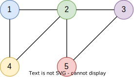
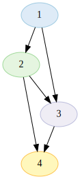
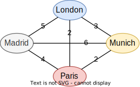
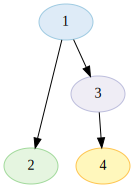
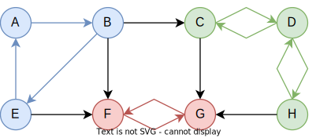
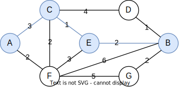
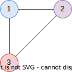

# 

`graph` is a generic library for creating graph data structures and performing operations on them.
It supports different kinds of graphs such as directed graphs, acyclic graphs, or trees.

# Features

* Vertices of any data type, such as `int` or `City`.
* Optionally combinable graph types and traits.
* Validations considering the graph type, such as cycle detection in acyclic graphs.
* Determination of graph and vertex properties, such as degree or tree-depth.
* Non-recursive walks, DFS, and BFS.
* Pathfinding algorithms, considering edge weights where appropriate:
  * [ ] Hamiltonian paths and cycles
  * [ ] Eulerian paths and cycles
  * [x] Shortest path (Dijkstra)
  * [x] Strongly connected components (Tarjan)

> Status: Work in progress. Multigraphs aren't supported at the moment.

# Getting started

```
go get github.com/dominikbraun/graph
```

# Quick examples

## Create a graph of integers



```go
g := graph.New(graph.IntHash)

g.Vertex(1)
g.Vertex(2)
g.Vertex(3)
g.Vertex(4)
g.Vertex(5)

_ = g.Edge(1, 2)
_ = g.Edge(1, 4)
_ = g.Edge(2, 3)
_ = g.Edge(2, 4)
_ = g.Edge(2, 5)
_ = g.Edge(3, 5)
```

## Create a directed acyclic graph of integers



```go
g := graph.New(graph.IntHash, graph.Directed(), graph.Acyclic())

g.Vertex(1)
g.Vertex(2)
g.Vertex(3)
g.Vertex(4)

_ = g.Edge(1, 2)
_ = g.Edge(1, 3)
_ = g.Edge(2, 3)
_ = g.Edge(2, 4)
_ = g.Edge(3, 4)
```

## Create a graph of a custom type

To understand this example in detail, see the [concept of hashes](#hashes).

```go
type City struct {
    Name string
}

cityHash := func(c City) string {
    return c.Name
}

g := graph.New(cityHash)

g.Vertex(london)
```

## Create a weighted graph



```go
g := graph.New(cityHash, graph.Weighted())

g.Vertex(london)
g.Vertex(munich)
g.Vertex(paris)
g.Vertex(madrid)

_ = g.WeightedEdge(london, munich, 3)
_ = g.WeightedEdge(london, paris, 2)
_ = g.WeightedEdge(london, madrid, 5)
_ = g.WeightedEdge(munich, madrid, 6)
_ = g.WeightedEdge(munich, paris, 2)
_ = g.WeightedEdge(paris, madrid, 4)
```

## Perform a Depth-First Search

This example traverses and prints all vertices in the graph in DFS order.



```go
g := graph.New(graph.IntHash, graph.Directed())

g.Vertex(1)
g.Vertex(2)
g.Vertex(3)

_ = g.Edge(1, 2)
_ = g.Edge(2, 3)
_ = g.Edge(3, 1)

_ = g.DFS(1, func(value int) bool {
    fmt.Printf(value)
    return false
})
```

```
1 3 4 2
```

## Find strongly connected components



```go
g := graph.New(graph.IntHash)

// Add vertices and edges ...

scc, _ := g.StronglyConnectedComponents()

fmt.Println(scc)
```

```
[[1 2 5] [3 4 8] [6 7]]
```

## Find the shortest path



```go
g := graph.New(graph.StringHash, graph.Weighted())

// Add vertices and weighted edges ...

path, _ := g.ShortestPath()

fmt.Println(path)
```

```
[A C E B]
```

## Cycle checks for acyclic graphs



```go
g := graph.New(graph.IntHash, graph.Acyclic())

g.Vertex(1)
g.Vertex(2)
g.Vertex(3)

_ _= g.Edge(1, 2)
_ _= g.Edge(1, 3)

if err := g.Edge(2, 3); err != nil {
    panic(err)
}
```

```
panic: an edge between 2 and 3 would introduce a cycle
```

# Concepts

## Hashes

A graph consists of nodes (or vertices) of type `T`, which are identified by a hash value of type
`K`. The hash value is obtained using the hashing function passed to `graph.New`.

### Primitive types

For primitive types such as `string` or `int`, you may use a predefined hashing function such as
`graph.IntHash` – a function that takes an integer and uses it as a hash value at the same time:

```go
g := graph.New(graph.IntHash)
```

> This also means that only one vertex with a value like `5` can exist in the graph if
> `graph.IntHash` used.

### Custom types

For storing custom data types, you need to provide your own hashing function. This example function
takes a `City` and returns the city name as an unique hash value:

```go
cityHash := func(c City) string {
    return c.Name
}
```

Creating a graph using this hashing function will yield a graph with vertices of type `City`
identified by hash values of type `string`.

```go
g := graph.New(cityHash)
```

## Traits

The behavior of a graph, for example when adding or retrieving edges, depends on its traits. You
can set the graph's traits using the functional options provided by this library:

```go
g := graph.New(graph.IntHash, graph.Directed(), graph.Weighted())
```

# Documentation

The full documentation is available at [pkg.go.dev](https://pkg.go.dev/github.com/dominikbraun/graph).
