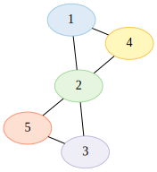
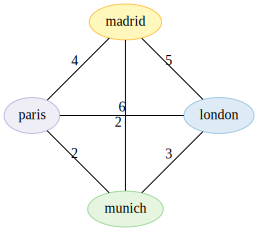
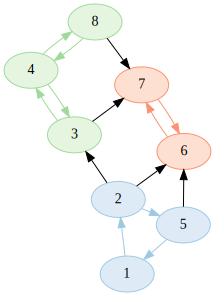
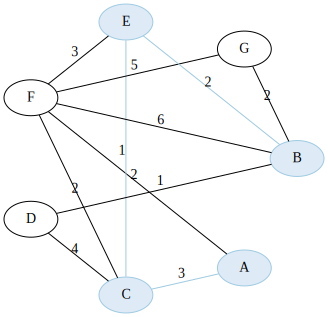
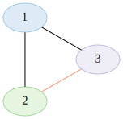

# 

`graph` is a generic library for creating graph data structures and performing operations on them.
It supports different kinds of graphs such as directed graphs, acyclic graphs, or trees.

# Features

* Vertices of any data type, such as `int` or `City`.
* Edges with optional data, such as weights or attributes.
* Optionally combinable graph types and traits.
* Validations considering the graph type, such as cycle detection in acyclic graphs.
* Determination of graph and vertex properties, such as degree or tree-depth.
* Non-recursive walks, DFS, and BFS.
* Pathfinding algorithms, considering edge weights where appropriate:
  * [ ] Hamiltonian paths and cycles
  * [ ] Eulerian paths and cycles
  * [x] Shortest path (Dijkstra)
  * [x] Strongly connected components (Tarjan)
* Visualization of graphs using Graphviz.
* Extensive tests with ~90% coverage.

> Status: Because `graph` is in version 0, the public API shouldn't be considered stable.

# Getting started

```
go get github.com/dominikbraun/graph
```

# Quick examples

## Create a graph of integers



```go
g := graph.New(graph.IntHash)

g.AddVertex(1)
g.AddVertex(2)
g.AddVertex(3)
g.AddVertex(4)
g.AddVertex(5)

_ = g.AddEdge(1, 2)
_ = g.AddEdge(1, 4)
_ = g.AddEdge(2, 3)
_ = g.AddEdge(2, 4)
_ = g.AddEdge(2, 5)
_ = g.AddEdge(3, 5)
```

## Create a directed acyclic graph of integers


```go
g := graph.New(graph.IntHash, graph.Directed(), graph.Acyclic())

g.AddVertex(1)
g.AddVertex(2)
g.AddVertex(3)
g.AddVertex(4)

_ = g.AddEdge(1, 2)
_ = g.AddEdge(1, 3)
_ = g.AddEdge(2, 3)
_ = g.AddEdge(2, 4)
_ = g.AddEdge(3, 4)
```

## Create a graph of a custom type

To understand this example in detail, see the [concept of hashes](#hashes).

```go
type City struct {
    Name string
}

cityHash := func(c City) string {
    return c.Name
}

g := graph.New(cityHash)

g.AddVertex(london)
```

## Create a weighted graph



```go
g := graph.New(cityHash, graph.Weighted())

g.AddVertex(london)
g.AddVertex(munich)
g.AddVertex(paris)
g.AddVertex(madrid)

_ = g.AddEdge("london", "munich", graph.EdgeWeight(3))
_ = g.AddEdge("london", "paris", graph.EdgeWeight(2))
_ = g.AddEdge("london", "madrid", graph.EdgeWeight(5))
_ = g.AddEdge("munich", "madrid", graph.EdgeWeight(6))
_ = g.AddEdge("munich", "paris", graph.EdgeWeight(2))
_ = g.AddEdge("paris", "madrid", graph.EdgeWeight(4))
```

## Perform a Depth-First Search

This example traverses and prints all vertices in the graph in DFS order.


```go
g := graph.New(graph.IntHash, graph.Directed())

g.AddVertex(1)
g.AddVertex(2)
g.AddVertex(3)
g.AddVertex(4)

_ = g.AddEdge(1, 2)
_ = g.AddEdge(1, 3)
_ = g.AddEdge(3, 4)

_ = graph.DFS(g, 1, func(value int) bool {
    fmt.Println(value)
    return false
})
```

```
1 3 4 2
```

## Find strongly connected components



```go
g := graph.New(graph.IntHash)

// Add vertices and edges ...

scc, _ := graph.StronglyConnectedComponents(g)

fmt.Println(scc)
```

```
[[1 2 5] [3 4 8] [6 7]]
```

## Find the shortest path



```go
g := graph.New(graph.StringHash, graph.Weighted())

// Add vertices and weighted edges ...

path, _ := graph.ShortestPath(g, "A", "B")

fmt.Println(path)
```

```
[A C E B]
```

## Cycle checks for acyclic graphs



```go
g := graph.New(graph.IntHash, graph.Acyclic())

g.AddVertex(1)
g.AddVertex(2)
g.AddVertex(3)

_ = g.AddEdge(1, 2)
_ = g.AddEdge(1, 3)

if err := g.Edge(2, 3); err != nil {
    panic(err)
}
```

```
panic: an edge between 2 and 3 would introduce a cycle
```

## Visualize a graph using Graphviz

The following example will generate a DOT description for `g` and write it into the given file.

```go
g := graph.New(graph.IntHash, graph.Directed())

g.AddVertex(1)
g.AddVertex(2)
g.AddVertex(3)

_ = g.AddEdge(1, 2)
_ = g.AddEdge(1, 3)

file, _ := os.Create("./mygraph.gv")
_ = draw.DOT(g, file)
```

To generate an SVG from the created file using Graphviz, use a command such as the following:

```
dot -Tsvg -O mygraph.gv
```

## Setting edge attributes

Edges may have one or more attributes which can be used to store metadata. Attributes will be taken
into account when [visualizing a graph](#visualize-a-graph-using-graphviz). For example, this edge
will be rendered in red color:

```go
_ = g.AddEdge(1, 2, graph.EdgeAttribute("color", "red"))
```

To get an overview of all supported attributes, take a look at the
[DOT documentation](https://graphviz.org/doc/info/attrs.html).

# Concepts

## Hashes

A graph consists of nodes (or vertices) of type `T`, which are identified by a hash value of type
`K`. The hash value is obtained using the hashing function passed to `graph.New`.

### Primitive types

For primitive types such as `string` or `int`, you may use a predefined hashing function such as
`graph.IntHash` – a function that takes an integer and uses it as a hash value at the same time:

```go
g := graph.New(graph.IntHash)
```

> This also means that only one vertex with a value like `5` can exist in the graph if
> `graph.IntHash` used.

### Custom types

For storing custom data types, you need to provide your own hashing function. This example function
takes a `City` and returns the city name as an unique hash value:

```go
cityHash := func(c City) string {
    return c.Name
}
```

Creating a graph using this hashing function will yield a graph with vertices of type `City`
identified by hash values of type `string`.

```go
g := graph.New(cityHash)
```

## Traits

The behavior of a graph, for example when adding or retrieving edges, depends on its traits. You
can set the graph's traits using the functional options provided by this library:

```go
g := graph.New(graph.IntHash, graph.Directed(), graph.Weighted())
```

# Documentation

The full documentation is available at [pkg.go.dev](https://pkg.go.dev/github.com/dominikbraun/graph).
